# HabitHive

Una plataforma moderna para gestionar hábitos, colmenas y más, construida con Next.js, TypeScript, Material-UI y Tailwind CSS.

## Equipo TheVoids

- Juan Manuel Marín Angarita (A00382037)
- Cristian Eduardo Botina Carpio (A00395008)
- Óscar Andrés Gómez Lozano (A00394142)

## 🚀 Tecnologías

- **Framework**: Next.js
- **Lenguaje**: TypeScript
- **UI**: Material-UI (MUI) + Tailwind CSS
- **Estado**: React Context API
- **Testing**: Jest + React Testing Library + Cypress (E2E)
- **Linting**: ESLint + Prettier
- **Git Hooks**: Husky + lint-staged
- **Deploy**: Railway con pipeline automatizado

## 🤑 Funcionalidades Implementadas

- **Dashboard administrativo**: vista resumen con accesos rápidos filtrados por permisos del usuario.
  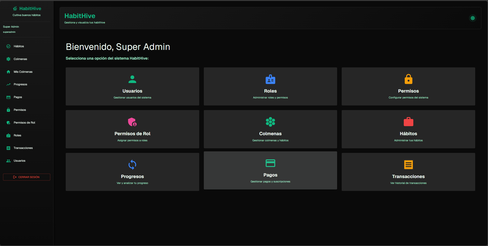

- **Gestión de hábitos (HabitHive)**: CRUD para hábitos, colmenas, miembros, progresos, transacciones y pagos con tablas, formularios dinámicos y modales reutilizables.
  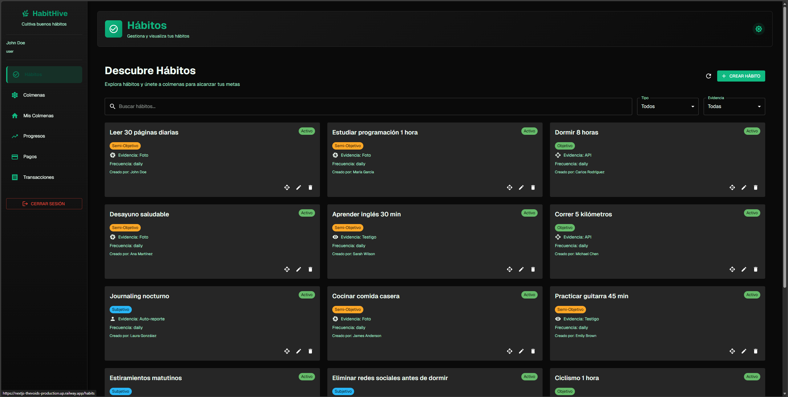
  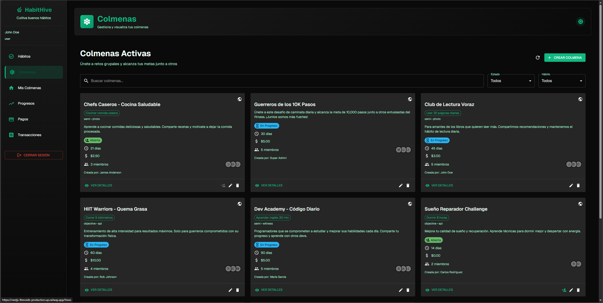
  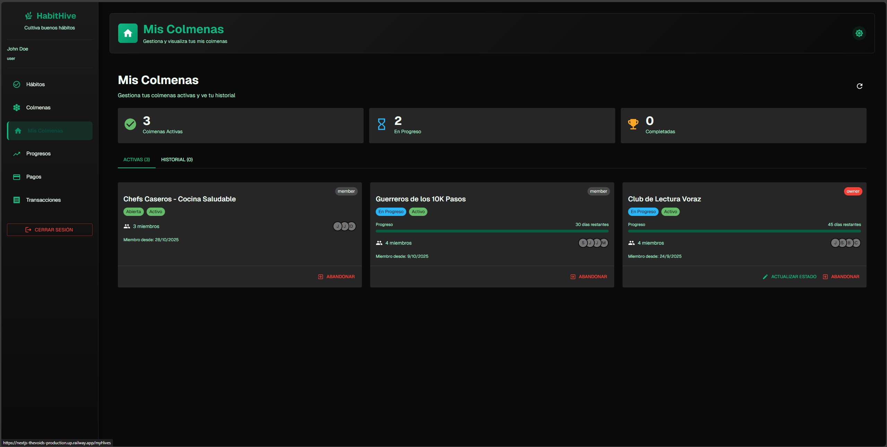
  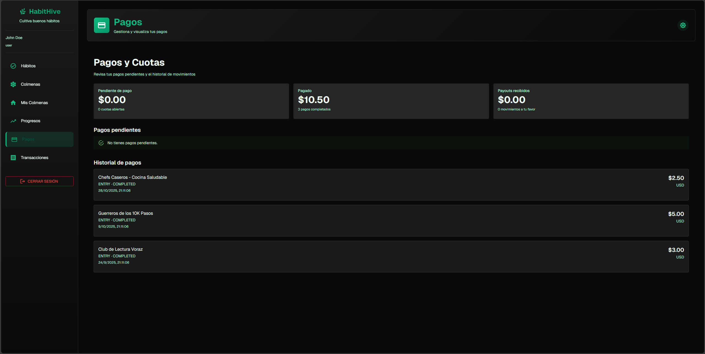
  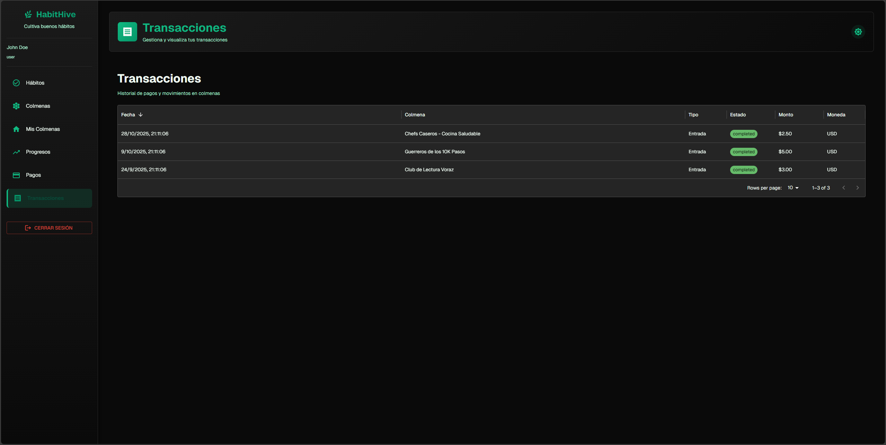

- **Gestión de usuarios**: módulos para usuarios, roles, permisos y asignaciones, cada uno con formularios basados en esquemas y tablas filtrables.
  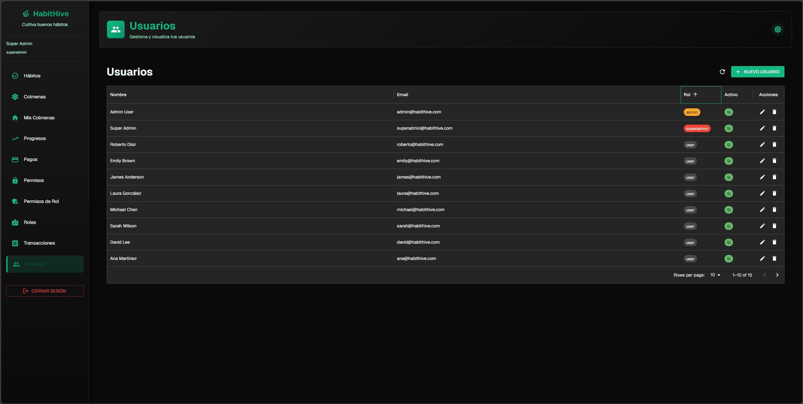
  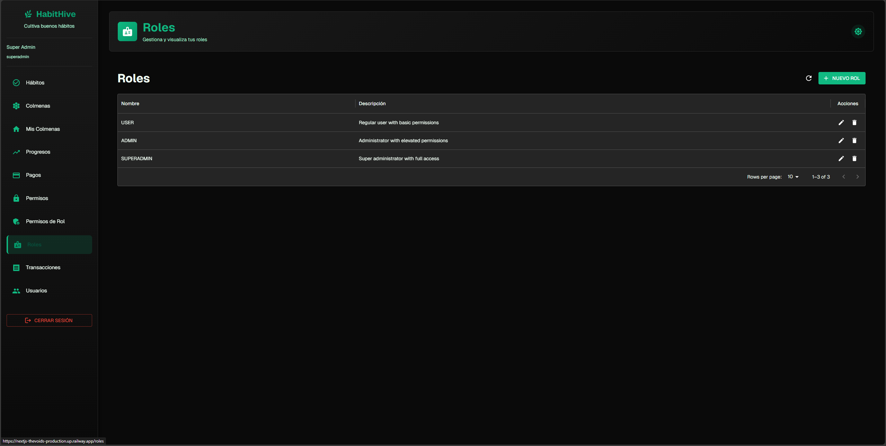
  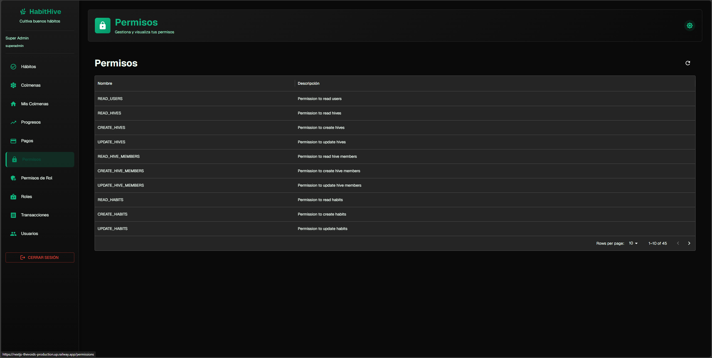
  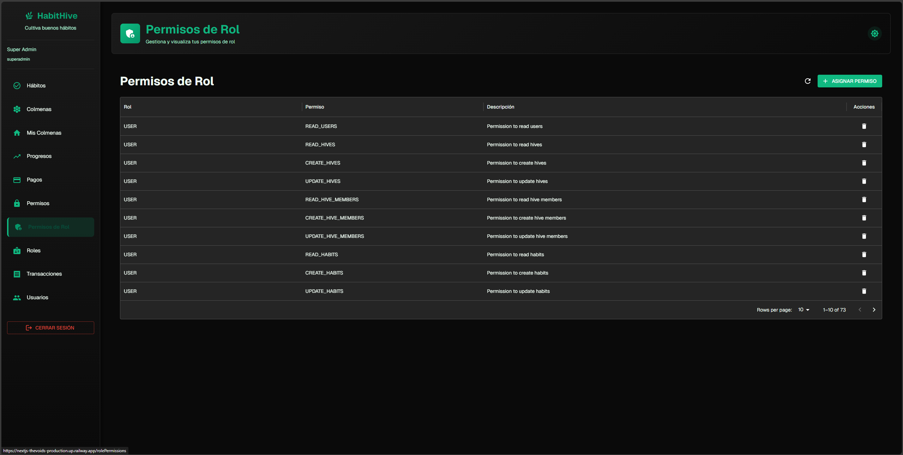

- **Flujo de autenticación**: pantalla de login con validaciones, manejo de errores y redirección según credenciales.
  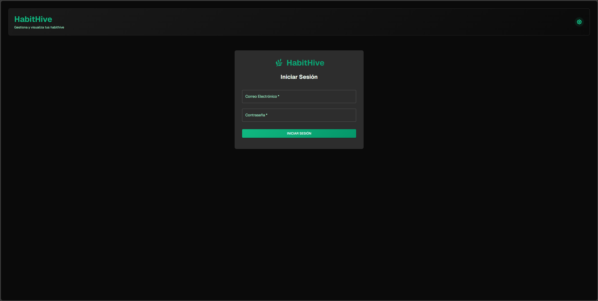

- **Protección de rutas y navegación dinámica**: Navbar, encabezados y tarjetas del dashboard ajustados a los permisos activos.
  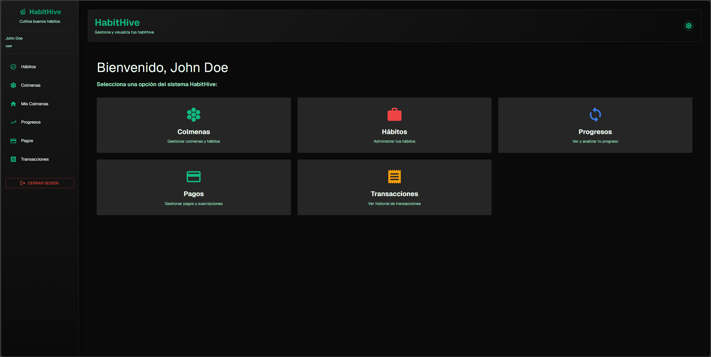

- **Tema y experiencia UI**: modo claro/oscuro persistente, gradientes personalizados y componentes responsivos.
  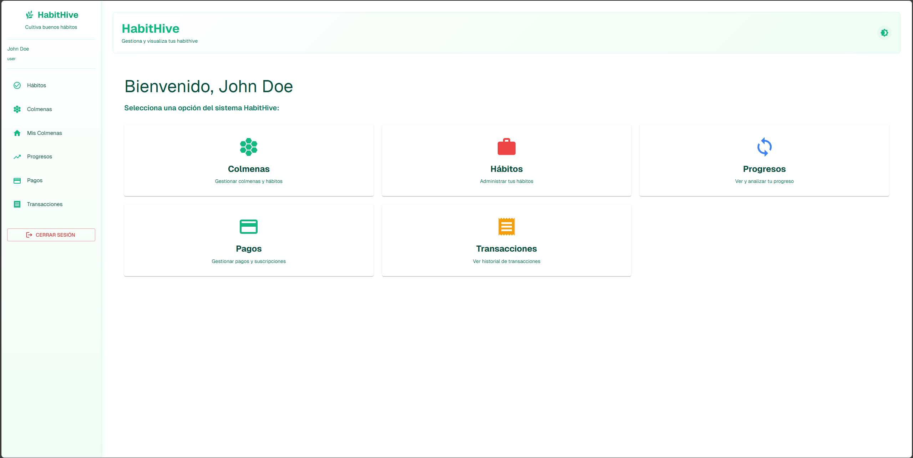

## 🔐 Autenticación y Autorización

- **Login seguro**: `app/(userManagement)/login/page.tsx` consume `lib/api/auth.ts` para autenticar y almacenar token, datos de sesión y permisos en `AuthContext`.
- **Verificación de permisos**: `AuthContext` expone `hasPermission`, utilizada por Navbar, PageHeader, tarjetas del dashboard y formularios para mostrar u ocultar acciones.
- **Rutas protegidas**: `ProtectedRoute` mantiene un mapa de permisos mínimos; si el usuario no los cumple, lo redirige al inicio, evitando accesos directos por URL.
- **UI dependiente de permisos**: los items de navegación y las cards del dashboard se filtran en tiempo real con base en los permisos vigentes, garantizando una experiencia personalizada.
- **Pruebas automatizadas**: las suites Jest (`*.test.tsx`) cubren escenarios de autenticación y autorización, validando respuestas de UI ante distintos permisos simulados.

## 🧠 Gestión del Estado

- **Contextos globales**: `AuthContext` gestiona sesión y permisos, mientras `DataContext` centraliza catálogos y colecciones consumidas desde la API.
- **Proveedores estructurados**: `AppProviders` y `MuiThemeProvider` envuelven la aplicación, exponiendo temas, autenticación y datos a cualquier componente.
- **Sincronización con la API**: los contextos usan los clientes declarados en `lib/api` (basados en fetch tipado) para mantener datos frescos y consistentes.
- **Formularios declarativos**: `FormBuilder` recibe configuraciones dinámicas y delega eventos al contexto, reduciendo duplicación en los módulos CRUD.
- **Persistencia ligera**: la preferencia de tema utiliza `localStorage` y el estado de autenticación se mantiene en memoria para evitar exponer credenciales sensibles.

## 🛠️ Desarrollo

### Instalación

```bash
npm install
```

### Servidor de Desarrollo

```bash
npm run dev
```

Abre [http://localhost:5173](http://localhost:5173) en tu navegador.

### Scripts Disponibles

```bash
# Desarrollo
npm run dev          # Inicia servidor de desarrollo (puerto 5173)
npm run build        # Construye para producción
npm run start        # Inicia servidor de producción

# Calidad de Código
npm run lint         # Ejecuta ESLint
npm run lint:fix     # Ejecuta ESLint y corrige errores automáticamente
npm run format       # Formatea código con Prettier
npm run format:check # Verifica formato con Prettier
npm run type-check   # Verifica tipos TypeScript

# Testing
npm run test              # Ejecuta tests unitarios
npm run test:watch        # Ejecuta tests en modo watch
npm run test:coverage     # Genera reporte de cobertura
npm run test:e2e          # Abre Cypress (modo interactivo)
npm run test:e2e:headless # Ejecuta tests E2E en modo headless

# Git Hooks (automáticos)
# pre-commit: lint-staged (lint + format)
```

### Configuración de VS Code

Se recomienda instalar las siguientes extensiones:

- **ESLint** - Linting de código
- **Prettier** - Formateo de código
- **Tailwind CSS IntelliSense** - Autocompletado CSS
- **TypeScript Importer** - Importaciones inteligentes

Las configuraciones de VS Code están incluidas en `.vscode/settings.json`.

## 📁 Estructura del Proyecto

```
habithive/
├── app/                           # Next.js App Router
│   ├── (habitHive)/               # Grupo de rutas - Gestión de hábitos
│   │   ├── habits/                # Página de hábitos
│   │   ├── hives/                 # Página de colmenas
│   │   ├── hiveMembers/           # Página de miembros
│   │   ├── payments/              # Página de pagos
│   │   ├── progresses/            # Página de progresos
│   │   └── transactions/          # Página de transacciones
│   ├── (userManagement)/          # Grupo de rutas - Gestión de usuarios
│   │   ├── login/                 # Página de login
│   │   ├── users/                 # Página de usuarios
│   │   ├── roles/                 # Página de roles
│   │   ├── permissions/           # Página de permisos
│   │   ├── rolePermissions/       # Asignación permisos a roles
│   │   └── userRoles/             # Asignación roles a usuarios
│   ├── globals.css                # Estilos globales
│   ├── layout.tsx                 # Layout principal
│   └── page.tsx                   # Página principal (dashboard)
├── lib/                           # Librerías y utilidades
│   ├── api/                       # Clientes API
│   │   ├── auth.ts                # API de autenticación
│   │   ├── client.ts              # Cliente HTTP base
│   │   ├── users.ts               # API de usuarios
│   │   ├── roles.ts               # API de roles
│   │   ├── permissions.ts         # API de permisos
│   │   ├── rolePermissions.ts     # API de permisos de roles
│   │   └── userRoles.ts           # API de roles de usuarios
│   ├── components/                # Componentes compartidos
│   │   ├── AppProviders.tsx       # Providers de la app
│   │   ├── DataTable.tsx          # Tabla de datos genérica
│   │   ├── FormBuilder.tsx        # Constructor de formularios
│   │   ├── Modal.tsx              # Modal reutilizable
│   │   ├── MuiThemeProvider.tsx   # Provider de tema MUI
│   │   ├── Navbar.tsx             # Barra de navegación
│   │   ├── PageHeader.tsx         # Encabezado de página
│   │   ├── ProtectedRoute.tsx     # Protección de rutas
│   │   ├── ThemeContext.tsx       # Contexto de tema
│   │   └── ThemeUpdater.tsx       # Actualizador de tema
│   ├── contexts/                  # Contextos React
│   │   ├── AuthContext.tsx        # Contexto de autenticación
│   │   └── DataContext.tsx        # Contexto de datos
│   └── utils.ts                   # Utilidades generales
├── tests/                         # Tests
│   └── e2e/                       # Tests End-to-End
│       ├── features/              # Archivos .feature (Gherkin)
│       │   ├── auth.feature       # Tests de autenticación
│       │   ├── users.feature      # Tests de usuarios
│       │   ├── roles-permissions.feature  # Tests de roles
│       │   ├── permissions.feature        # Tests de permisos
│       │   ├── rolePermissions.feature    # Tests asignación permisos
│       │   └── userRoles.feature          # Tests asignación roles
│       ├── step_definitions/      # Implementación de pasos
│       │   ├── auth.ts            # Steps de autenticación
│       │   ├── users.ts           # Steps de usuarios
│       │   ├── roles-permissions.ts  # Steps de roles
│       │   ├── permissions.ts     # Steps de permisos
│       │   └── userRoles.ts       # Steps de roles de usuarios
│       ├── support/               # Soporte y configuración
│       │   ├── commands.ts        # Comandos personalizados
│       │   └── e2e.ts             # Setup global
│       ├── README.md              # Documentación E2E
│       ├── TEST_SUMMARY.md        # Resumen de tests
│       └── QUICK_START.md         # Guía rápida
├── coverage/                      # Reportes de cobertura
├── cypress/                       # Cypress (screenshots, videos)
├── .husky/                        # Git hooks
├── .vscode/                       # Configuración VS Code
├── cypress.config.ts              # Configuración Cypress
├── jest.config.ts                 # Configuración Jest
├── jest.setup.ts                  # Setup Jest
├── eslint.config.mjs              # Configuración ESLint
├── .prettierrc                    # Configuración Prettier
├── .cypress-cucumber-preprocessorrc.json  # Config Cucumber
├── run-e2e-tests.ps1              # Script helper E2E
└── package.json                   # Dependencias y scripts
```

**Cobertura Actual:**

- ✅ Statements: 93.85%
- ✅ Branches: 82.12%
- ✅ Functions: 80.88%
- ✅ Lines: 93.85%

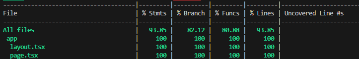
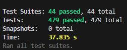

### Tests End-to-End (Cypress + Cucumber)

El proyecto incluye **X escenarios E2E** que cubren todas las funcionalidades principales:

**Features implementadas:**

- ✅ Autenticación (X escenarios)
- ✅ Gestión de Usuarios (X escenarios)
- ✅ Gestión de Roles (X escenarios)
- ✅ Gestión de Permisos (X escenarios)
- ✅ Asignación de Permisos a Roles (X escenarios)
- ✅ Asignación de Roles a Usuarios (X escenarios)
